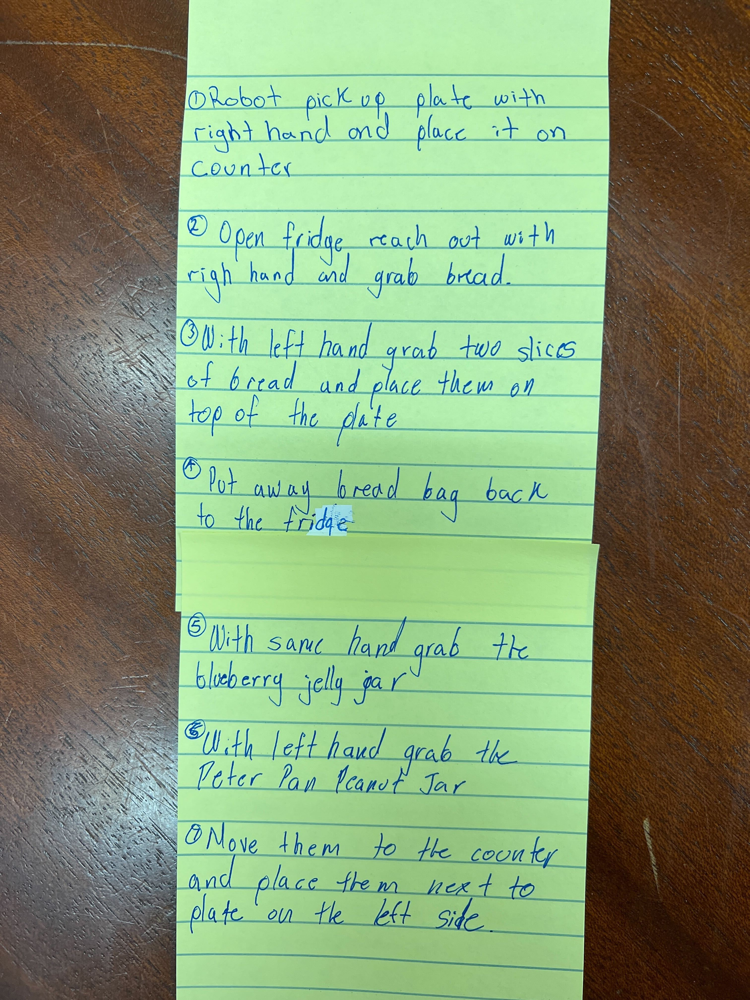

# Sandwiches

Y'all did a straight-up _amazing_ job with this pseudocode activity, and it's worth memorializing. If you can break down logic this way, everything else about coding is just a matter of:

1. Being aware of what _can_ be done
2. Remembering/looking up the syntax to tell the computer to do it

-----------

## Marilyn's group

1. With the knowledge that you have ingredients at home,(bread, peanut butter, jelly, plate, knife, napkin, counter space) check if you have all ingredients
2. With your right hand reach out retrieve bread from your pantry, and set it on the countertop, in the same manner, do the same to retrieve the peanut butter jar and jelly
3. Retrieve the plate with both hands and place it on the countertop
4. Untwist the bag of bread and reach into the bag and retrieve two slices of bread
5.  Place the slices of bread side by side on the plate
6. Retrieve a butter knife from where ever you keep your knives
7. Grab the jar of peanut butter with one hand and untwist the lid with your other hand, do the same for the jelly jar
8. Hold the handle of the knife and bring your knife down vertically into the peanut butter jar using a rotating motion scoop out the peanut butter and spread it evenly horizontally onto one piece of the bread, do this same step again if you want more peanut butter
9. Hold the handle of the knife and bring your knife down vertically into the jelly jar using a rotating motion scoop out the jelly and spread it evenly horizontally onto one piece of the bread, do this same step again if you want more jelly
10. Carefully with one hand lift one slice and flip it onto the other slice so the peanut butter and jelly come together
11. Gently compress  down towards the plate so they stick together (you can use the same knife to carefully remove excess peanut butter and jelly from the sides by vertically sliding the knife along each of the edges of your sandwich)
12. Pick it up and eat it

## Lorraine's group

1. Pick the brand of peanut butter and jelly you want and brand of bread
2. Pick peanut butter texture (how creamy) and pick jelly flavor
3. Go to the store and find what aisle the peanut butter and jelly is in
4. Purchase your peanut butter and jelly and bread
5. Go home or to a place with a kitchen
6. Go in your silverware drawer and get a knife
7. Take a clean plate from a cupboard
8. Place the plate on a counter with the flat side facing up
9. Open the bag of bread
10. Put 2 slices of bread on the plate (one of the left and one on the right)
11. Open the jar of peanut butter
12. Put the knife into the peanut butter jar
13. Take the knife out of the jar with one teaspoon of peanut butter on it
14. Use the knife to spread peanut butter onto the piece of bread on the left
15. Open the jar of jelly
16. Put the knife into the jelly jar
17. Take the knife out of the jar with one teaspoon of jelly on it
18. Use the knife to spread the jelly onto the piece of bread on the right
19. Put the piece of bread with the jelly on top of the piece of bread with the peanut butter so the peanut butter and jelly touch
20. Eat your sandwich

## Francis / Melissa / Peter / Janelle

1. The robot retrieves the ingredients from kitchen
    1. Robot gets peanut butter jar from cupboard Robot gets bread from cupboard
    2. Robot gets two butter-knives
    3. Robot labels butter-knives as “jelly” and “peanut butter” knife
    4. Robot gets jelly jar from fridge
    5. Robot gets a plate
2. Place items on kitchen table
3. Assembles sandwich
    1. Robot picks up loaf of bread
        1. Opens packaging bread
        2. Retrieves two slices of bread
            - Slice pb - left
            - Slice j - right
        3. Place bread on plate next to each other
    2. Robot picks up peanut butter
        1. Opens peanut butter jar, by turning lid counter clockwise
        2. Stir peanut butter with peanut butter knife
        3. Scoop peanut butter with peanut butter knife
        4. Spread peanut butter on pb bread slice on plate
        5. Evenly distributes peanut butter pb bread slice
        6. Optional - cannot lick knife
    3. Robot picks up jelly
        1. Opens jelly jar
        2. Scoop jelly with jelly knife
        3. Spread jelly  on bread on plate
        4. Evenly distributes jelly on j bread slice
        5. Optional - cannot lick knife
4. Complete sandwich
    1. Robot takes pb bread slice and j bread slice
    2. Condiments should face each other
    3. Press bread slices together
5. Enjoy sandwich
    1. Robot picks up slice
    2. Robot takes bite

## Travis' group

Scanned PDF: [LINK](travis_group.pdf)

## Guillermo's group

